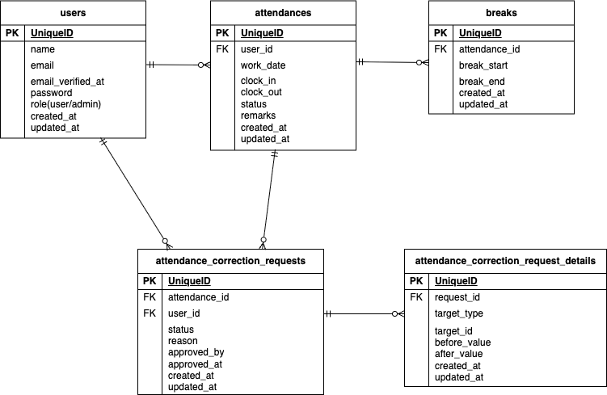

# Attendance Management（勤怠管理アプリ）  
  
勤怠の打刻（出勤・退勤・休憩）を管理し、勤怠修正申請と管理者による承認フローを提供するWebアプリケーションです。  
ユーザーは日々の勤怠を記録し、誤った打刻があった場合には修正申請を行うことができます。  
管理者はその申請内容を確認し、承認または却下することができます。  
  
## 主な機能  
  
### ユーザー機能  
ユーザー登録  
ログイン / ログアウト  
出勤打刻  
退勤打刻  
休憩開始 / 終了  
勤怠修正申請  
  
### 管理者機能  
勤怠修正申請の承認 / 却下  
ユーザー管理  
  
## 開発環境構築  
  
## Dockerビルド
  
git@github.com:laughricotetsu/Attendance-Management.git  
  
DockerDesktopアプリを立ち上げる  
docker-compose up -d --build  
  
MacのM1・M2チップのPCの場合、no matching manifest for linux/arm64/v8 in the manifest list entriesのメッセージが表示されビルドができないことがあります。 エラーが発生する場合は、docker-compose.ymlファイルの「mysql」内に「platform」の項目を追加で記載してください  
  
mysql:  
    platform: linux/x86_64  
    image: mysql:8.0.26  
    environment:  
### Docker起動  
docker-compose up -d  
  
### Laravelセットアップ  
docker-compose exec php bash 
composer install  
cp .env.example .env  
（.envに以下の環境変数を追加）  
DB_CONNECTION=mysql  
DB_HOST=mysql  
DB_PORT=3306  
DB_DATABASE=laravel_db  
DB_USERNAME=laravel_user  
DB_PASSWORD=laravel_pass  
  
### アプリケーションキーの作成  
php artisan key:generate  
### マイグレーション の実行  
php artisan migrate  
  
### シーディングの実行  
php artisan db:seed  
  
  
## 使用技術(実行環境)  
  
PHP8.3.0  
Laravel8.83.27.  
MySQL8.0.26  
  

## メール認証機能
mailhogを使用しています。 
  
### ■ MailHogの画面  
ブラウザで以下にアクセスしてください：  
http://localhost:8025  
  
### ■ Laravelのメール設定  
1. .env ファイルを以下のように設定してください：  
  
MAIL_MAILER=smtp  
MAIL_HOST=mailhog  
MAIL_PORT=1025  
MAIL_USERNAME=null  
MAIL_PASSWORD=null  
MAIL_ENCRYPTION=null  
MAIL_FROM_ADDRESS=test@example.com  
MAIL_FROM_NAME="Laravel App"  
  
2. docker-compose.ymlを修正してください:  
 services:  
 app:  
 mailhog:  
 image: mailhog/mailhog  
 container_name: mailhog  
 ports:  
 -"8025:8025"  
 -"1025:1025"  
  
3. 起動  
 docker-compose up -d  
  
### ■ 動作確認手順  
  
- MailHogを起動する  
- Laravelでメール送信処理を実行（例：ユーザー登録など）  
- http://localhost:8025 を開く  
- メールが表示されていれば成功  
  
### ■ よくあるトラブル(メールが届かない場合)  
- MailHogが起動しているか確認  
  docker-compose ps  
  
- Laravelの設定を反映  
  php artisan config:clear  
  
- .env の MAIL_HOST=mailhog になっているか確認  
  
## テーブル仕様  
  
### usersテーブル  
| カラム名 | 型 | primary key | unique key | not null | foreign key |  
| --- | --- | --- | --- | --- | --- |  
| id | unsigned bigint | ◯ |  | ◯ |  |  
| name | string |  |  | ◯ |  |  
| email | string |  |  | ◯ |  |  
| email_verified_at | timestamp |  |  |  |  |  
| password | string |  |  | ◯ |  |  
| role | string |  |  | ◯ |  |  
| created_at | timestamp |  |  |  |  |  
| updated_at | timestamp |  |  |  |  |  
  
### attendancesテーブル  
| カラム名 | 型 | primary key | unique key | not null | foreign key |  
| --- | --- | --- | --- | --- | --- |  
| id | unsigned bigint | ◯ |  | ◯ |  |  
| user_id | unsigned bigint |  |  | ◯ | ◯ |  
| work_date | date |  |  |  |  |  
| clock_in | time |  |  |  |  |  
| clock_out | time |  |  |  |  |  
| status | string |  |  |  |  |  
| remarks | string |  |  |  |  |  
| created_at | timestamp |  |  |  |  |  
| updated_at | timestamp |  |  |  |  |  
  
### breaksテーブル  
| カラム名 | 型 | primary key | unique key | not null | foreign key |  
| --- | --- | --- | --- | --- | --- |  
| id | unsigned bigint | ◯ |  | ◯ |  |  
| attendance_id | unsigned bigint |  |  | ◯ | ◯ |  
| break_start | time |  |  |  |  |  
| break_end | time |  |  |  |  |  
| created_at | timestamp |  |  |  |  |  
| updated_at | timestamp |  |  |  |  |  
  
### attendance_correction_requestsテーブル  
| カラム名 | 型 | primary key | unique key | not null | foreign key |  
| --- | --- | --- | --- | --- | --- |  
| id | unsigned bigint | ◯ |  | ◯ |  |  
| attendance_id | unsigned bigint |  |  | ◯ | ◯ |  
| user_id | unsigned bigint |  |  | ◯ | ◯ |  
| status | string |  |  |  |  |  
| reason | string |  |  | ◯ |  |  
| approved_by | unsigned bigint |  |  | ◯ | ◯ |  
| approved_at | timestamp |  |  |  |  |  
| created_at | timestamp |  |  |  |  |  
| updated_at | timestamp |  |  |  |  |  
  
### attendance_correction_request_detailsテーブル  
| カラム名 | 型 | primary key | unique key | not null | foreign key |  
| --- | --- | --- | --- | --- | --- |  
| id | unsigned bigint | ◯ |  | ◯ |  |  
| request_id | unsigned bigint |  |  | ◯ | ◯ |  
| target_type | string |  |  |  |  |  
| target_id | unsignedBigInteger |  |  |  |  |  
| before_value | text |  |  |  |  |  
| after_value | text |  |  |  |  |  
| created_at | timestamp |  |  |  |  |  
| updated_at | timestamp |  |  |  |  |  
  
  
## リレーション  
  
users	1 : N attendances  
attendances	1 : N breaks  
attendances	1 : N attendance_correction_requests  
users	1 : N attendance_correction_requests  
attendance_correction_requests	1 : N attendance_correction_request_details  
  
## ER図

  
## PHPUnitを利用したテストに関して  
  
### テスト用の.envファイルの作成  
PHPコンテナにログインし、.envをコピーして.env.testingファイルを作成してください。  
  
 $ cp .env .env.testing  
  
### .env.testingの編集  
  
1. ファイルの文頭部分にあるAPP_ENVとAPP_KEYを編集  
  
APP_ENV=test  
APP_KEY=  
  
2. データベースの接続情報を編集  
  
DB_DATABASE=demo_test  
DB_USERNAME=root  
DB_PASSWORD=root  
  
3. テスト用のアプリケーションキーを加える  
  
 $ php artisan key:generate --env=testing  
  
 $ php artisan config:clear  
  
### テスト用のテーブルを作成  
  
 $ php artisan migrate --env=testing  
  
### PHPUnitを実行  
  
 $ php artisan test  
  
  

## URL  
- 開発環境：http://localhost/
- phpMyAdmin:：http://localhost:8080/